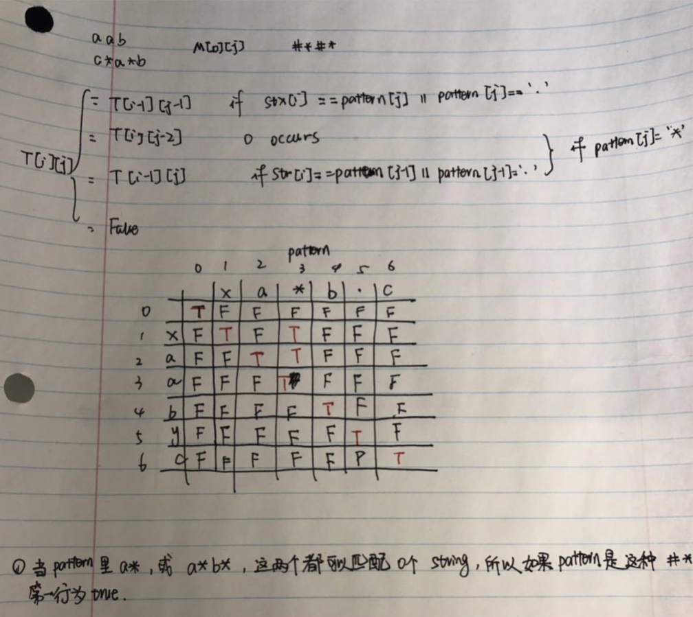

# 10. Regular Expression Matching

Given an input string \(`s`\) and a pattern \(`p`\), implement regular expression matching with support for `'.'` and `'*'`.

```text
'.' Matches any single character.
'*' Matches zero or more of the preceding element.
```

The matching should cover the **entire** input string \(not partial\).

**Note:**

* `s` could be empty and contains only lowercase letters `a-z`.
* `p` could be empty and contains only lowercase letters `a-z`, and characters like `.` or `*`.

**Example 1:**

```text
Input:
s = "aa"
p = "a"
Output: false
Explanation: "a" does not match the entire string "aa".
```

**Example 2:**

```text
Input:
s = "aa"
p = "a*"
Output: true
Explanation: '*' means zero or more of the precedeng element, 'a'. Therefore, by repeating 'a' once, it becomes "aa".
```

**Example 3:**

```text
Input:
s = "ab"
p = ".*"
Output: true
Explanation: ".*" means "zero or more (*) of any character (.)".
```

**Example 4:**

```text
Input:
s = "aab"
p = "c*a*b"
Output: true
Explanation: c can be repeated 0 times, a can be repeated 1 time. Therefore it matches "aab".
```

**Example 5:**

```text
Input:
s = "mississippi"
p = "mis*is*p*."
Output: false
```

方法一：用recursive

时间复杂度：O\(\(T+P\)2 T+ 2 P ​\)

空间复杂度：O\(\(T+P\)2 T+ 2 P ​\)

```text
class Solution {
    public boolean isMatch(String s, String p) {
        if(p == null || s == null)
            return false;
        
        if (p.length() == 0) 
            return s.length() == 0;
        
        if (p.length() == 1) 
            return s.length() == 1 && (p.charAt(0) == '.' || p.charAt(0) == s.charAt(0)) ;
        
        if (p.charAt(1) == '*') {
            if (isMatch(s, p.substring(2))) 
                return true;
            return s.length() > 0 && (p.charAt(0) == '.' || s.charAt(0) == p.charAt(0)) && isMatch(s.substring(1), p);
        } else {
            return s.length() > 0 && (p.charAt(0) == '.' || s.charAt(0) == p.charAt(0)) && isMatch(s.substring(1), p.substring(1));
        }
    }    
}
```

方法二：DP



有三种情况。注意这里因为pattern没法匹配第一行，所以除了\[0\]\[0\]之外都是F。

还有代码是从1开始的，但是这里是从0开始的。

时间复杂度：O\(m\*n\)

空间复杂度：O\(m\*n\)

```text
class Solution {
    public boolean isMatch(String s, String p) {
        int m = s.length();
        int n = p.length();
        boolean[][] dp = new boolean[m + 1][n + 1];
        dp[0][0] = true;
        // this is setting the first row, since when p is "#*#*", it can match s.length() == 0
        for (int j = 2; j < n + 1; j += 2) {
            if (p.charAt(j - 1) == '*' && dp[0][j - 2]) 
                dp[0][j] = true;
        }
        // There are 3 conditions
        for (int i = 1; i < m + 1; i++) {       // row represents s
            for (int j = 1; j < n + 1; j++) {   // column represents p
                if (s.charAt(i - 1) == p.charAt(j - 1) || p.charAt(j - 1) == '.') {
                    dp[i][j] = dp[i - 1][j - 1];
                } else if (p.charAt(j - 1) == '*') {
                    // two different conditions
                    dp[i][j] = dp[i][j - 2];
                    if (s.charAt(i - 1) == p.charAt(j - 2) || p.charAt(j - 2) == '.') {
                        dp[i][j] = dp[i - 1][j] || dp[i][j];
                    }
                } 
            }
        }
        return dp[m][n];
    }
}
```

