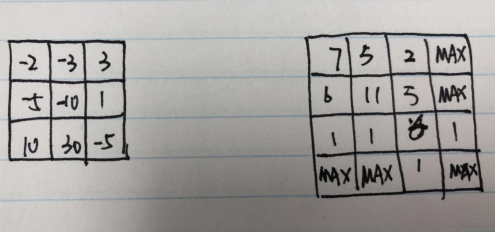

# 174. Dungeon Game

The demons had captured the princess \(**P**\) and imprisoned her in the bottom-right corner of a dungeon. The dungeon consists of M x N rooms laid out in a 2D grid. Our valiant knight \(**K**\) was initially positioned in the top-left room and must fight his way through the dungeon to rescue the princess.

The knight has an initial health point represented by a positive integer. If at any point his health point drops to 0 or below, he dies immediately.

Some of the rooms are guarded by demons, so the knight loses health \(_negative_integers\) upon entering these rooms; other rooms are either empty \(_0's_\) or contain magic orbs that increase the knight's health \(_positive_ integers\).

In order to reach the princess as quickly as possible, the knight decides to move only rightward or downward in each step.

**Write a function to determine the knight's minimum initial health so that he is able to rescue the princess.**

For example, given the dungeon below, the initial health of the knight must be at least **7** if he follows the optimal path `RIGHT-> RIGHT -> DOWN -> DOWN`.

| -2 \(K\) | -3 | 3 |
| :--- | :--- | :--- |
| -5 | -10 | 1 |
| 10 | 30 | -5 \(P\) |

**Note:**

* The knight's health has no upper bound.
* Any room can contain threats or power-ups, even the first room the knight enters and the bottom-right room where the princess is imprisoned.

方法一: 二维DP，dp\[i\]\[j\]表示的是从公主所在位置到当前\(i,j\)需要的血。状态转移方程：

```text
dp[i][j] = Math.max(1, Math.min(dp[i][j + 1], dp[i + 1][j]) - dungeon[i][j]);
```

先选择右边和下边需要血最少的路径，然后减去当前所在位置对血的损耗。如果dungeon\[i\]\[j\]是负数，减完就是正数，然后再和1取最大值。如果dungeon\[i\]\[j\]是正数，减完可能是正数也可能是负数，负数表示当前节点会补充能量，不需要过多能量，所以dp\[i\]\[j\]=1。

时间复杂度：O\(n\*m\)

空间复杂度：O\(n\*m\)

```text
class Solution {
    public int calculateMinimumHP(int[][] dungeon) {
        int m = dungeon.length;
        int n = dungeon[0].length;
        int[][] dp = new int[m][n];
        for (int i = m - 1; i >= 0; i--) {
            for (int j = n - 1; j >= 0; j--) {
                if (i == m - 1 && j == n - 1) {
                    dp[i][j] = Math.max(1 - dungeon[i][j], 1);
                } else if (j == n - 1) {
                    dp[i][j] = Math.max(dp[i + 1][j] - dungeon[i][j], 1);
                } else if (i == m - 1) {
                    dp[i][j] = Math.max(dp[i][j + 1] - dungeon[i][j], 1);
                } else {
                    dp[i][j] = Math.max(1, Math.min(dp[i][j + 1], dp[i + 1][j]) - dungeon[i][j]);
                }
            }
        }
        return dp[0][0];
    }
}
```

方法二：在最下面和最右面各加一行，可以不用考虑边界问题



```text
class Solution {
    public int calculateMinimumHP(int[][] dungeon) {
        int m = dungeon.length;
        int n = dungeon[0].length;
        int[][] dp = new int[m + 1][n + 1];
        for (int[] d : dp) {
            Arrays.fill(d, Integer.MAX_VALUE);
        }
        dp[m][n - 1] = dp[m - 1][n] = 1;
        for (int i = m - 1; i >= 0; i--) {
            for (int j = n - 1; j >= 0; j--) {
                dp[i][j] = Math.max(1, Math.min(dp[i][j + 1], dp[i + 1][j]) - dungeon[i][j]);
            }
        }
        return dp[0][0];
    }
}
```

方法三

O\(n\) space

```text
class Solution {
    public int calculateMinimumHP(int[][] dungeon) {
        int m = dungeon.length;
        int n = dungeon[0].length;
        int[] dp = new int[n + 1];
        Arrays.fill(dp, Integer.MAX_VALUE);
        dp[n - 1] = 1;
        for (int i = m - 1; i >= 0; i--) {
            for (int j = n - 1; j >= 0; j--) {
                dp[j] = Math.max(1, Math.min(dp[j + 1], dp[j]) - dungeon[i][j]);
            }
        }
        return dp[0];
    }
}
```

